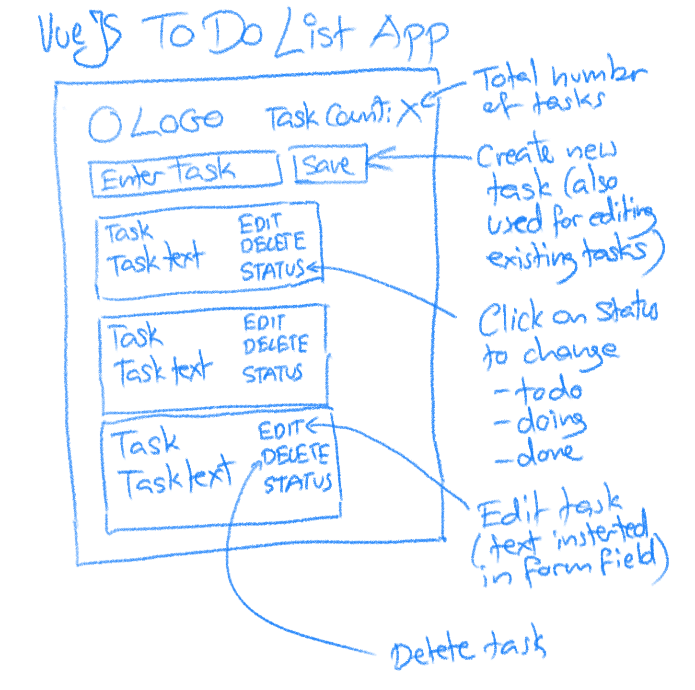
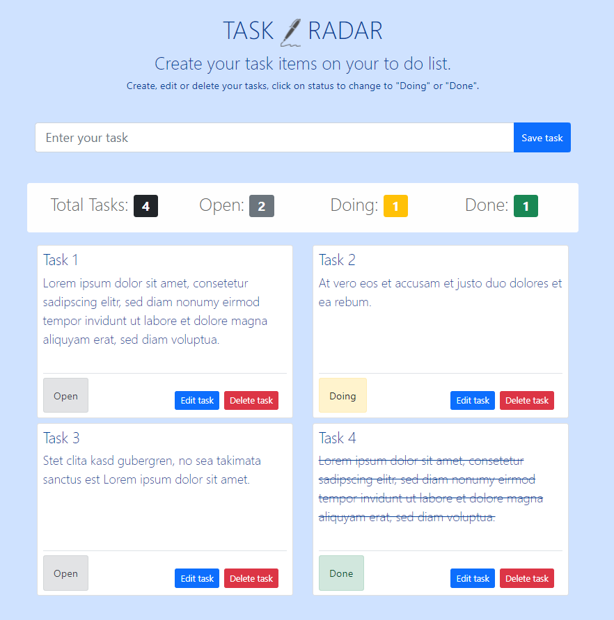

# Task Radar

This is a little VueJS exercise to create a to do app. It has the following features:
- Tasks with a name and status.
- New tasks can be added, edited and deleted.
- Existing tasks can be marked done and the number of done tasks is displayed.

## Concept


## Implementation


## Instructions from VueJS Template

### Project setup
```
npm install
```

#### Compiles and hot-reloads for development
```
npm run serve
```

#### Compiles and minifies for production
```
npm run build
```

#### Lints and fixes files
```
npm run lint
```

#### Customize configuration
See [Configuration Reference](https://cli.vuejs.org/config/).
